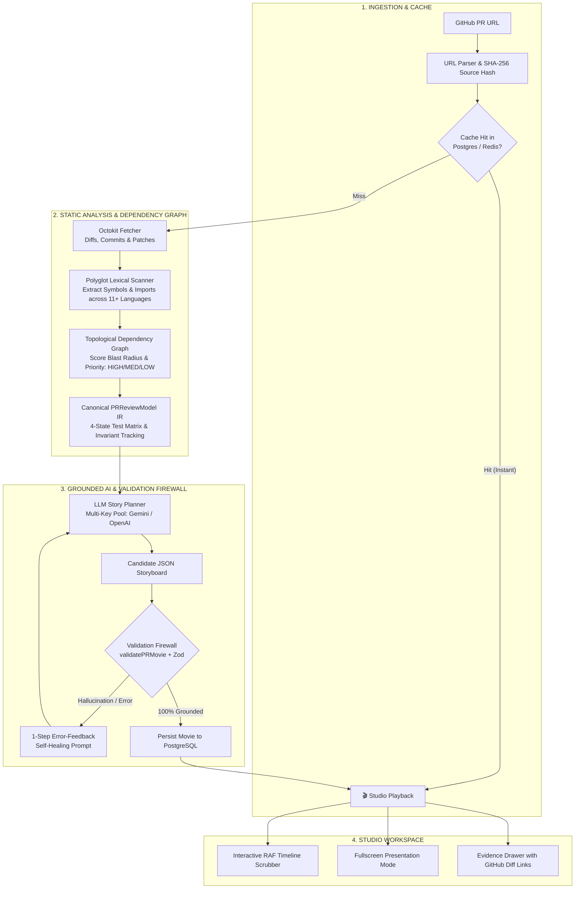

<div align="center">

# PullMotion

**Turn 40-file GitHub pull requests into animated, 6-scene review storyboards.**

[](https://nextjs.org)
[](https://www.typescriptlang.org)
[](https://www.prisma.io)
[](https://www.postgresql.org)
[](https://upstash.com)
[](https://vitest.dev)
[](LICENSE)

[Pipeline Architecture](#how-it-works) &bull; [Review Flow](#the-6-scene-storyboard) &bull; [Quickstart](#quickstart)

</div>

---

## Why PullMotion?

Opening a 40-file pull request on GitHub is overwhelming. Files are displayed alphabetically, business logic is buried in boilerplate churn, and reviewers must mentally reconstruct the architecture from scratch.

**PullMotion builds the mental model for you:**

- **Topological Review Order**: Reviews are ordered by execution dependency (Schema &rarr; Core Logic &rarr; API Endpoints &rarr; UI &rarr; Tests), not alphabetical sorting.
- **100% Line-Level Citations**: Every claim, diagram node, and code snippet links directly to verified line numbers in the GitHub diff.
- **Zero-Hallucination Firewall**: Deterministic AST analysis validates all AI output against the codebase before rendering.
- **Zero-Storage Privacy**: Diffs are processed strictly in ephemeral RAM and never stored or used for model training.

---

## How It Works

PullMotion combines deterministic static analysis with a multi-key AI orchestration layer and a strict validation firewall:



---

## The 6-Scene Storyboard

Every pull request is automatically transformed into a structured 6-stage review experience:

| Scene | Name | What Reviewers Get |
|:---:|:---|:---|
| **1** | **Executive Overview** | Problem statement, PR metrics (+/- diffs, commits), architectural impact, and contract verdict. |
| **2** | **Architecture & Data Flow** | Interactive Before/After node-edge diagram comparing system topologies across clients, APIs, and databases. |
| **3** | **Code Walkthrough** | Reviewer-prioritized diffs (High/Med/Low) with symbol shifts, invariant changes, and watch-outs. |
| **4** | **Domain Breakdown** | Categorized matrix across features, APIs, database schemas, configs, refactors, and tests. |
| **5** | **File Manifest** | Complete catalog of affected files with addition/deletion counts and risk flags. |
| **6** | **Action Plan & Checklist** | Evidence-grounded assertions (facts, risks, questions) with an automated verification checklist. |

---

## Quickstart

### Prerequisites
- Node.js &ge; 20.0.0
- PostgreSQL &ge; 15.0
- GitHub Personal Access Token (`public_repo` scope)
- Upstash Redis &amp; Clerk accounts

### 1. Clone & Install
```bash
git clone https://github.com/irajatsharma-10/pullmotion.git
cd pullmotion
npm install
```

### 2. Configure Environment
```bash
cp .env.example .env
# Fill in DATABASE_URL, GITHUB_TOKEN, GEMINI_API_KEYS, CLERK, and UPSTASH credentials in .env
```

### 3. Initialize & Run
```bash
npm run contract:emit
npm run dev
```

Open [http://localhost:3000](http://localhost:3000) in your browser.

---

## Testing

```bash
# Run all unit and integration test suites (69 tests)
npm test

# Run tests in watch mode
npm run test:watch
```

---

## License

Distributed under the [MIT License](LICENSE).

<div align="center">

Built for engineers who respect their own time.<br/>

</div>
